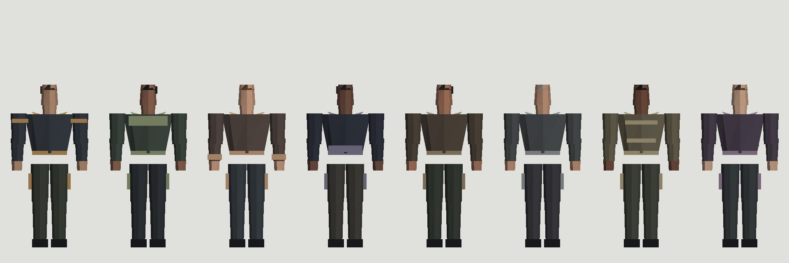
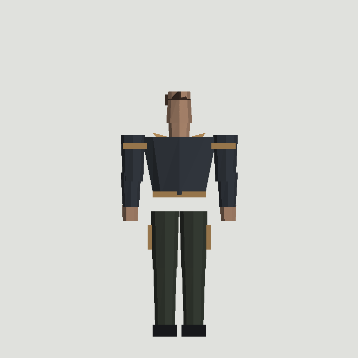
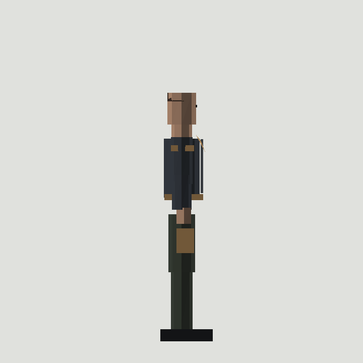
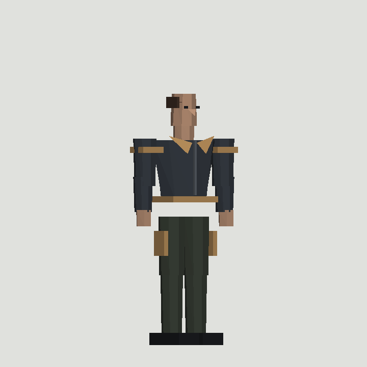
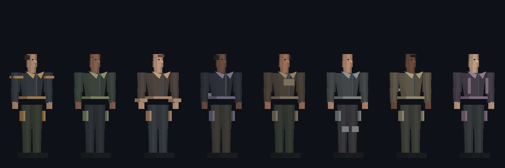

# Personagens 3D — Armed Mystery

Pacote independente de **recursos visuais** low-poly para Godot 4.4.1. Os oito
modelos representam o mesmo personagem-base e não codificam papel, equipe,
equipamento ou vantagem. Este repositório não contém nem modifica o projeto do
jogo.



## Entrega

| variante neutra | arquivo | triângulos medidos | detalhe de leitura |
|---|---|---:|---|
| Ember | `models/mystery_character_ember.glb` | 567 | faixas nos ombros |
| Moss | `models/mystery_character_moss.glb` | 555 | pala contrastante nas costas |
| Dawn | `models/mystery_character_dawn.glb` | 567 | punhos contrastantes |
| Night | `models/mystery_character_night.glb` | 555 | faixa posterior na barra |
| Cedar | `models/mystery_character_cedar.glb` | 555 | painel frontal no peito |
| Ash | `models/mystery_character_ash.glb` | 567 | painéis nos joelhos |
| Sand | `models/mystery_character_sand.glb` | 567 | faixas traseiras duplas |
| Plum | `models/mystery_character_plum.glb` | 567 | painéis frontais verticais |

Todos os GLBs são glTF 2.0 binários e autocontidos: geometria, índices e oito
materiais PBR estão no próprio arquivo. Não existem texturas ou caminhos externos.
As contagens acima são obtidas dos accessors de índices pelo validador, não são
estimativas. O relatório reproduzível está em `docs/validation_report.json`.

### Prévias

| frente | lado — nariz e bico do tênis apontam para **+Z** | perspectiva |
|---|---|---|
|  |  |  |



## Escala, origem e orientação

* Unidades: **metros**; escala do nó raiz: `(1, 1, 1)`.
* Origem local: `(0, 0, 0)`, no piso e entre os pés.
* Eixo vertical: **+Y**. Limites medidos: `Y = 0.000–1.800 m`.
* Frente inequívoca do modelo: **+Z**. O nariz e os bicos dos tênis projetam-se
  em +Z; a prévia lateral acima permite detectar uma inversão.
* Largura máxima: `0.86–0.87 m`, decorrente da pose neutra dos braços. Profundidade:
  `Z = -0.155–0.225 m`.

As alturas-chave seguem os insumos: solado 0,00; tornozelo 0,08; joelho 0,50;
virilha 0,92; cintura 1,05; ombros 1,48; queixo 1,57; olhos 1,68; topo 1,80 m.
A geometria não deve ser usada para recalcular a cápsula do controlador.

## Hierarquia

Cada arquivo contém uma cena `VisualOnly`, com a raiz `CharacterVisual` e nós
nomeados para partes (`Shoe.L`, `Thigh.R`, `Jacket`, `Zipper`, `UpperArm.L`,
`Hand.R`, `Head`, `Hair` etc.). As partes são separadas visual e logicamente,
facilitando uma futura substituição por malha deformável/rig. A entrega atual é
uma pose neutra rígida: **não contém armature, skin nem animações**. Portanto,
`idle` e `walk` não são declarados como prontos.

## Materiais

Materiais simples usam `baseColorFactor`, `roughnessFactor` e `metallicFactor` do
glTF. Jaqueta, calça e cabelo são foscos; apenas `Metal` (zíper) tem metallic 0,55
e roughness 0,38. A fonte não replica `shading_mode = 2` do `.tres` de referência:
os modelos reagem à iluminação PBR. Não há transparência, normal maps ou texturas,
o que mantém o custo e o download baixos para Web.

## Importação no Godot 4.4.1

1. Copie apenas o GLB desejado para a pasta de assets do projeto do jogo.
2. Aguarde a importação glTF do editor e abra a cena herdada para conferir a
   orientação. Não habilite geração de colisão: a colisão oficial já existe.
3. Instancie o GLB como filho do nó visual do `CharacterBody3D` existente. Mantenha
   transformação local identidade; qualquer correção de orientação deve ocorrer
   no ponto visual oficial do jogo, de forma idêntica para todas as variantes.
4. Preserve `Camera3D`, cápsula, raycast, inventário, lógica de movimento e
   autoridade multiplayer existentes. O arquivo `MysteryPlayer.gd` deste repositório
   é somente insumo e **não deve ser anexado**.
5. Escolha a aparência por um identificador cosmético neutro e replicado pelo
   sistema oficial — nunca pela variável `role` ou por informação secreta.

Exemplo deliberadamente limitado à camada visual (adapte o caminho do nó, sem
substituir o controlador):

```gdscript
const APPEARANCES := {
    "ember": preload("res://characters/mystery_character_ember.glb"),
    "moss": preload("res://characters/mystery_character_moss.glb"),
    "dawn": preload("res://characters/mystery_character_dawn.glb"),
    "night": preload("res://characters/mystery_character_night.glb"),
    "cedar": preload("res://characters/mystery_character_cedar.glb"),
    "ash": preload("res://characters/mystery_character_ash.glb"),
    "sand": preload("res://characters/mystery_character_sand.glb"),
    "plum": preload("res://characters/mystery_character_plum.glb"),
}

func attach_cosmetic_visual(appearance_id: StringName) -> void:
    var visual: Node3D = APPEARANCES.get(appearance_id, APPEARANCES.ember).instantiate()
    $VisualMesh.add_child(visual)
```

## Reproduzir e editar a fonte

Python 3 é o único requisito. `tools/generate_characters.py` é a fonte procedural
editável: contém geometria, paletas, materiais, exportador GLB e renderizador das
prévias. Edite `VARIANTS` ou as primitivas de `build()` e execute:

```bash
python3 tools/generate_characters.py
python3 tools/validate_glb.py
```

O primeiro comando recria exatamente os oito GLBs e cinco PNGs deterministicamente. O
segundo reabre os contêineres GLB, interpreta JSON/BIN, accessors e posições e
confere quantidade, buffer embutido, materiais, triângulos, origem, altura e
projeção frontal +Z.

## Validação executada e limitações

* `python3 tools/generate_characters.py`: geração concluída para as oito variantes.
* `python3 tools/validate_glb.py`: `PASS`; veja os limites e contagens completos no
  relatório versionado.
* Não havia executável do Blender nem do Godot no ambiente de produção. Por isso
  não se afirma teste de importação no editor Godot, render Eevee ou animações.
* Na integração, ainda é necessário conferir visualmente no **Godot 4.4.1**:
  importação, culling, luz real da mansão, primeira/terceira pessoa, sombras,
  rotação do visual oficial, clipping com a cápsula e leitura em movimento.
* A fonte procedural é adequada a ajustes paramétricos. Para rig/deformação,
  importe o GLB em uma DCC, consolide a malha conforme necessário e crie armature,
  pesos e clips antes de alegar suporte a animação.

## Arquivos

```text
models/       8 GLBs finais
previews/     frente, lado, perspectiva, lineup e teste escuro
tools/        gerador/exportador e validador independentes
docs/         inventário de referências e relatório de validação
*.jpg         referências visuais originais preservadas
*.json/*.txt  proporções e materiais originais preservados
MysteryPlayer.gd e mat_mystery_neutral.tres  insumos preservados
```

Origem e licença dos insumos e do conteúdo criado estão documentadas em
[`docs/REFERENCES.md`](docs/REFERENCES.md).
